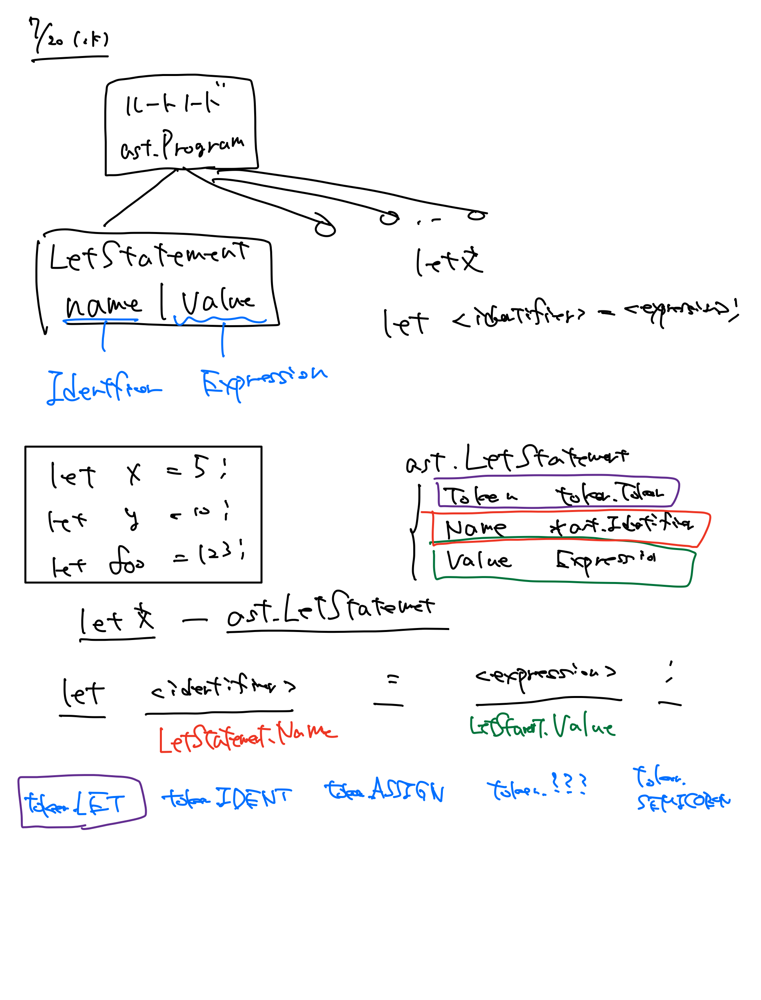

# 『Go言語でつくるインタプリタ』の写経と改造

## 本家

- [Writing An Interpreter In Go | Thorsten Ball](https://interpreterbook.com/)
- [O'Reilly Japan - Go言語でつくるインタプリタ](https://www.oreilly.co.jp/books/9784873118222/)

## サンプルコードDLリンク

https://interpreterbook.com/waiig_code_1.4.zip

<!--- ちょっと恥ずかしいのでコメントにしておこう

## Lexerこれじゃん

[(9) Lexical Scanning in Go - Rob Pike - YouTube](https://www.youtube.com/watch?v=HxaD_trXwRE&ab_channel=GoogleFOSSSydney)

- スライドを雑に眺めただけなんだけど、monkeyと同じやり方。なので読めた気になる
- 並行処理を使うとレキサーの設計がEasyになるって書いてあるけどほんまか？ww

## 2022/08/03(水) 字句解析何も見ないチャンレジ

- たぶん、100分くらい。
- だいぶ馴染んできた説がある
- このパターンの字句解析なら別言語でも行けそう。
- 実際はちょっとみた
- 終端に引っかかりがち。エッジケースやな
- 文字列のエスケープとかムズいね
- テストケース分けたほうが考えやすい

## 2022/08/02(火) タイムアタック

- 1章: だいたい60分かかる
- コミットメッセージはだるくなってやめた
- l.readPositionとか、全然忘れてた
- またやろう
- 腹減ったし、2章はまた今度！

## 2022/08/02 2章終わっったら、1章からすべて復習する

- 理由: 3章いってから3章に戻るのは多分無理だから。
    - あと、1章は60分くらいでおわるから一緒にやっちゃっていい
- やること
    - t.Run()を使うようにする
    - エラーメッセージにこだわる
    - bytes.Bufferじゃなくてstrings.Builderを使う
    - 理解するのが目標だから日本語をバンバン使う
    - traceはデバッグモードみたいなのをいれる
    - !testFoo と if !testFoo{return} の違いが謎
    - t.Fatalf と t.Errorf の使い分けが謎。特にサブテストのとき。実用Goに書いてないかな。

## コツ

## 1章: 字句解析器

- 60分あれば写経はいける！ 👍
- 細かいアルゴリズムやGo的なところはともかく！
- **Lexerのテストケースは1トークンずつ足していくとマジで分かりやすい**。最大でも1行。Lexerは意味の解釈はしないから1トークンずつでいいのだ。一気にやると、わかりにくいしやる気なくなる。
- JSONのレキサー(Notパーサー！)も、同じパターンで結構いけるんじゃね？
- 電卓のレキサーなら、登場するトークンが少ないからもっといい感じにいけるんじゃね？ お！？！？？
    - INT ( ) + - * / と ILLEGAL
    - これだけじゃん！！
    - **2文字トークンが存在しないから**、先読みもいらない

## 2章

- 経験が無いから、難しく感じるだけって話、なるほど
    - というわけで、プログラミング言語の構文解析器をシリアライズ形式（JSON、YAML、TOML、 INIなど） のパーサーと同様に身近に感じ、直感的に理解できるようになるためには、プログラミング
      言語の構文解析器が生成するデータ構造について理解する必要がある。

### let文を正しく構文解析するというのは一体どういうことだろうか？

それは、元のlet文に含まれる 情報を正確に表現したASTを構文解析器が生成することを意味する。これはもっともらしく聞こえる。
とは言うものの、まだASTは実装していないし、それがどういう形であるべきかすらわかっていない。
そこで、まずはMonkeyのソースコードをよく観察し、どのように構造化されているかを見ることにし よう。そうすれば、let文を正確に表現するにあたって、ASTに必要となる部品を定義できるようにな る。

### 各Nodeが何で、どういう型なのか、どういう属性なのかをいちいち確認したほうがいい!

っていうか、そうしないと無理だね。無の写経になる。

### `Parser.expectPeek()`は、期待するやつが来るなら読み進めちゃう！

トークンを読み進めるのか？ 変わらないか？ は大事なとこだとおもう

### let文をいちいち確認

-->